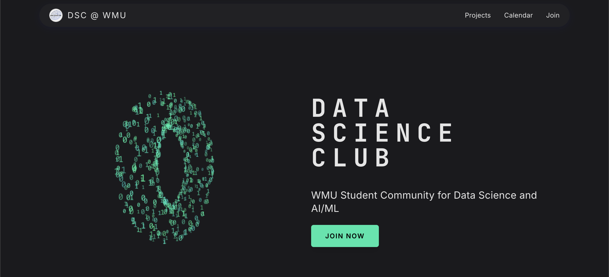

# DSC Website

This is the official website for the Data Science & AI Club at WMU, built with Next.js, React, TypeScript, and Tailwind CSS.

## About

This website showcases our club's projects, events, and provides information about our team. It's built using Next.js 15 with the App Router for optimized performance and SEO.

## Features

- Modern responsive design with Tailwind CSS
- TypeScript for type safety
- Server and client components for optimized rendering
- Internal links open in the same tab, external links open in new tabs

## Getting Started

1. Clone the repository
2. Install dependencies:

```bash
npm install
# or
yarn install
```

3. Run the development server:

```bash
npm run dev
# or
yarn dev
```

4. Open [http://localhost:3000](http://localhost:3000) in your browser to see the website.
