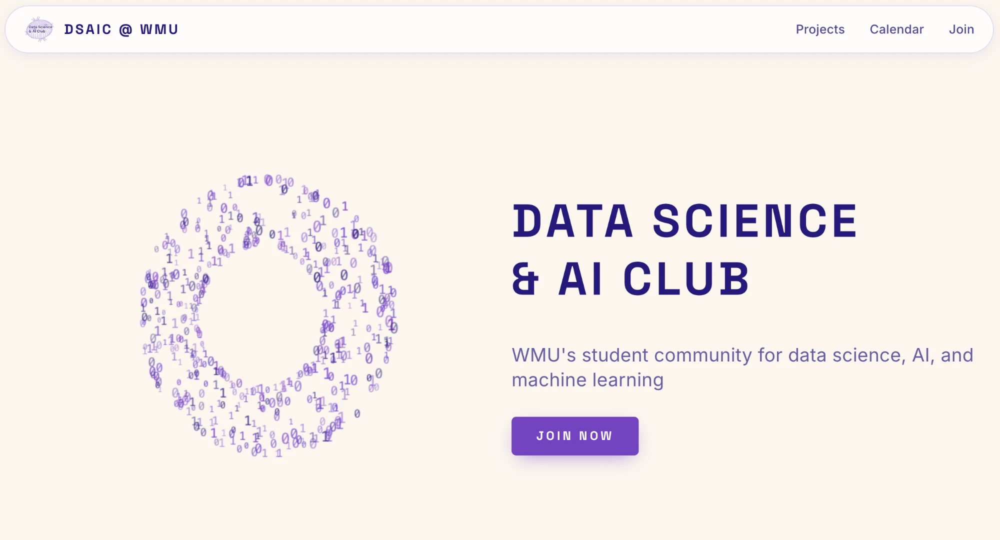

<div align="center">



# Data Science & AI Club at WMU

**The official website of DSAIC — WMU's student community for data science, AI, and machine learning.**

[**dscwmu.org**](https://dscwmu.org)


</div>

## Overview

A fully static, performance-focused site built with the Next.js App Router. It showcases the club's projects, events, and team, with structured data (schema.org) and per-page metadata for SEO.

## Features

- **Events in one place** — a single source of truth (`lib/events.ts`) feeds both the calendar page and the landing page schedule
- **Projects showcase** with active and past club projects
- **Photo gallery** cycling through club event photos
- **Smooth scrolling** powered by Lenis, with `prefers-reduced-motion` respected
- **Responsive design** across desktop, tablet, and mobile

## Getting Started

Requires Node.js 18.18+.

```bash
# clone this repository, then:
npm install
npm run dev
```

Open [http://localhost:3000](http://localhost:3000) to view the site. Other scripts:

```bash
npm run build   # production build
npm run start   # serve the production build
npm run lint    # lint the codebase
```

## Editing Content

| Content | Where |
| --- | --- |
| Events (calendar + landing schedule) | `lib/events.ts` — flip `featured` to show an event on the landing page |
| Active & past projects | `components/sections/Projects.tsx` |
| About-section photo gallery | `components/sections/About.tsx` + image files in `public/` |
| Team members | `components/sections/Team.tsx` + photos in `public/pfp/` |
| Site URL, description, socials | `lib/site.ts` |

## Project Structure

```
app/          # Routes (App Router): landing, projects, calendar, join, discord
components/   # Layout, sections, and card components
lib/          # Shared data and config (events, site metadata)
public/       # Static assets (photos, logos, favicons)
```

---

<div align="center">

Built and maintained by DSAIC members.

[Website](https://dscwmu.org) · [Instagram](https://www.instagram.com/dsaicwmu/) · [LinkedIn](https://www.linkedin.com/company/data-science-club-wmu/) · [Email](mailto:wmu.datascienceclub@gmail.com)

</div>
