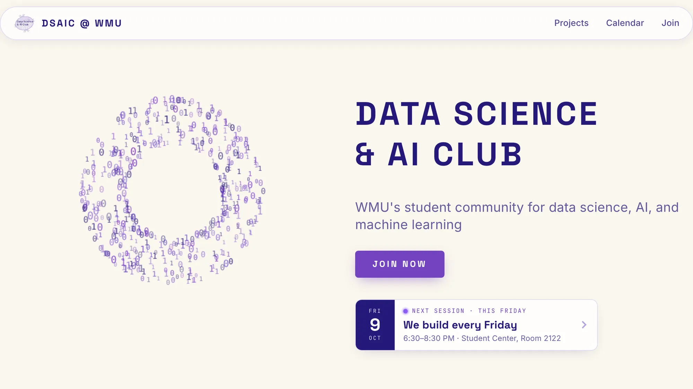

<div align="center">



# Data Science & AI Club at WMU

**The official website of DSAIC, Western Michigan University's student community for data science, AI, and machine learning.**

[Website](https://dscwmu.org) · [Calendar](https://dscwmu.org/calendar) · [Projects](https://dscwmu.org/projects) · [Join the club](https://dscwmu.org/join)

[](https://dscwmu.org)


</div>

## Contents

- [About](#about)
- [Features](#features)
- [Tech Stack](#tech-stack)
- [Getting Started](#getting-started)
- [Editing Content](#editing-content)
- [Project Structure](#project-structure)
- [SEO and Machine Readability](#seo-and-machine-readability)
- [Deployment](#deployment)
- [Contributing](#contributing)

## About

The site is where members and prospective members find out when the club meets, what it's building, and how to join. Its core is the weekly build session: every Friday, 6:30–8:30 PM, in the WMU Student Center. The schedule is kept in one data file and checks the date on its own, so the landing page, the calendar page, and the calendar feed all stay current without a redeploy.

## Features

- **Next build session up front.** A card under the hero shows the next session, switches to "Happening now" while one is running, and flags weeks off and room changes.
- **Calendar page.** Every Friday this semester, grouped by month, plus special events, past events, and recent Instagram recaps.
- **Add to calendar.** One click subscribes Google Calendar to the club feed; Apple Calendar and Outlook users get a downloadable `.ics` file.
- **Projects, officers, and resources.** Active and past club projects, the officer board, and a short list of learning resources.
- **Search and AI friendly.** Per-page metadata, schema.org structured data, a sitemap, and an `llms.txt` summary. See [SEO and Machine Readability](#seo-and-machine-readability).
- **Fast and accessible.** Statically generated, optimized images, responsive from phone to desktop, and smooth scrolling that turns off for `prefers-reduced-motion`.

## Tech Stack

| Area | Technology | Notes |
| --- | --- | --- |
| Framework | [Next.js 15](https://nextjs.org) (App Router) | Static pages regenerated at most hourly (ISR) |
| UI | [React 19](https://react.dev) | Server components by default, client components for interactive parts |
| Language | [TypeScript 5](https://www.typescriptlang.org) | Strict mode |
| Styling | [Tailwind CSS 4](https://tailwindcss.com) | Design tokens in `app/globals.css` |
| Fonts | Space Grotesk, Inter, JetBrains Mono | Loaded with `next/font` |
| Icons | [React Icons](https://react-icons.github.io/react-icons/) | Font Awesome set |
| Scrolling | [Lenis](https://lenis.darkroom.engineering) | Smooth scrolling, off for reduced motion |
| Images | `next/image`, [sharp](https://sharp.pixelplumbing.com) | Responsive photos; icon generation |
| Hosting | [Vercel](https://vercel.com) | Production from `main`, a preview for every pull request |
| Analytics | [Microsoft Clarity](https://clarity.microsoft.com) | Disclosed in the site footer |
| Linting | [ESLint 9](https://eslint.org) | `next/core-web-vitals` and `next/typescript` |

## Getting Started

**Prerequisites:** Node.js 18.18 or newer (20 LTS recommended) and npm.

Clone the repository, then install dependencies and start the development server:

```bash
npm install
npm run dev
```

Then open [http://localhost:3000](http://localhost:3000).

| Command | What it does |
| --- | --- |
| `npm run dev` | Start the development server with Turbopack |
| `npm run build` | Create a production build |
| `npm run start` | Serve the production build |
| `npm run lint` | Lint the codebase |
| `python3 scripts/create-og-image.py` | Rebuild the link preview card, `public/og-image.jpg` (needs Pillow) |
| `node scripts/create-favicon.js` | Regenerate the favicons and app icons from the club logo |

## Editing Content

Most updates only touch a data file:

| Content | Where |
| --- | --- |
| Weekly build sessions | `lib/events.ts`: `BUILD_SESSION` holds the usual day, time, and room; `BUILD_SESSIONS` lists each Friday, with `room` for a room change and `noSession` for a week off |
| Special events | `lib/events.ts`: `EVENTS`; give an event a `date` once it's scheduled and it shows on the landing page until it's over |
| Instagram recaps on the calendar page | `lib/instagram.ts`, plus 1080×1350 WebP images in `public/instagram/` |
| Projects | `components/sections/Projects.tsx` |
| About-section photo gallery | `components/sections/About.tsx`, plus image files in `public/` |
| Officers | `components/sections/Team.tsx`, plus photos in `public/pfp/` |
| Link preview image | `scripts/create-og-image.py`; after regenerating, bump the `?v=` in `SOCIAL_IMAGE` in `lib/site.ts` |
| Site URL, description, socials | `lib/site.ts` |

## Project Structure

```
app/
├── page.tsx            # Landing page
├── calendar/           # Build sessions, special events, Instagram recaps
├── projects/, join/    # Projects and membership pages
├── discord/            # Redirects to the Discord invite
├── calendar.ics/       # iCalendar feed behind "Add to calendar"
├── llms.txt/           # Plain-text summary of the club for AI assistants
├── layout.tsx          # Fonts, site-wide metadata, organization JSON-LD
└── sitemap.ts, robots.ts, manifest.ts
components/
├── sections/           # Page sections: Hero, Schedule, Team, and more
├── cards/, schedule/   # Cards and shared schedule pieces
└── layout/             # Header and footer
lib/                    # Content data (events, Instagram) and helpers (schedule, SEO)
public/                 # Photos, logos, icons, and the link preview image
scripts/                # Link preview and favicon generators
images/                 # README assets
```

## SEO and Machine Readability

- **Per-page metadata.** Each page has its own title, description, canonical URL, and Open Graph and Twitter card (`pageMetadata` in `lib/site.ts`).
- **Structured data.** schema.org JSON-LD describes the club (`EducationalOrganization`) on every page and each upcoming build session (`Event`) on the calendar page.
- **Crawling.** `sitemap.xml` lists every page, and `robots.txt` allows all crawlers, including AI crawlers.
- **`/llms.txt`.** A plain-text summary of the club, its upcoming sessions, and an index of the site for AI assistants, following [llmstxt.org](https://llmstxt.org).
- **`/calendar.ics`.** The schedule as an iCalendar feed, linked from the calendar page's `<head>`.

## Deployment

The site is hosted on Vercel. Merging to `main` deploys to [dscwmu.org](https://dscwmu.org), and every pull request gets its own preview URL.

Pages are static and regenerate at most once an hour, and the schedule re-checks the visitor's clock in the browser, so the next session stays correct between deploys. Absolute URLs default to `https://dscwmu.org`; set `NEXT_PUBLIC_SITE_URL` to override it for another domain.

## Contributing

1. Create a branch from `main`.
2. Make your changes, then run `npm run lint` and `npm run build`.
3. Open a pull request and check its Vercel preview.
4. Merge once it looks right; Vercel deploys it automatically.

---

<div align="center">

Built and maintained by DSAIC members.

[Website](https://dscwmu.org) · [Instagram](https://www.instagram.com/dsaicwmu/) · [LinkedIn](https://www.linkedin.com/company/data-science-club-wmu/) · [GitHub](https://github.com/Data-Science-Club-at-WMU) · [Email](mailto:wmu.datascienceclub@gmail.com)

</div>
